# ChainBI — DEX Analytics: Архитектура приложения

## 1. Требования к технологическому стеку
* **Язык программирования:** Python 3.
* **Фреймворк пользовательского интерфейса:** Taipy >= 4.0.
* **Библиотеки визуализации и обработки данных:** Plotly >= 5.0, Pandas >= 2.0, NumPy >= 1.26.
* **Базы данных:**
  * **ClickHouse** (`eywa`) — сделки DEX: аналитика дашборда, а также покрытие сигналов
    (сшивка целиком выполняется на его стороне). Единственная БД, к которой подключается
    само приложение.
  * **PostgreSQL** (`torch`) — арбитражные сигналы (`opportunities` + `opportunities_cross`).
    Приложение его **не открывает**: в него ходит сам ClickHouse (табличная функция
    `postgresql()`, доступы в `CH_PG_*`) и материализует сигналы у себя (`signals_legs`).
  * **SQLite** (`logins.db`) — учётные записи пользователей (авторизация / админ-панель).
* **Драйверы БД:** clickhouse-connect >= 0.7, sqlite3 (stdlib).
* **Управление окружением:** python-dotenv >= 1.0.

## 2. Компонентная диаграмма

```mermaid
graph TD
    User([Пользователь]) -->|HTTP/WebSocket| App(Точка входа: app.py)
    App -->|Инициализация UI| MainPage(Единая страница: main_page.py)
    App -->|Фоновый поток| Callbacks(Колбэки: callbacks.py)

    MainPage -->|События пользователя| Callbacks

    Callbacks -->|Запрос графиков| Viz(Визуализация: viz.py)
    Callbacks -->|Дашборд: данные| Queries(Слой дашборда: data/queries.py)
    Callbacks -->|Сигналы: данные| Signals(Слой сигналов: data/signals_service.py)
    Callbacks -->|Авторизация| Login(Авторизация: data/login_logic.py)
    Callbacks -->|Чтение настроек| Config(Конфигурация: config.py)

    Viz -->|Палитра / макет| Config
    Queries -->|SQL| Clickhouse(Коннектор: data/clickhouse.py)

    Signals -->|Покрытие: SQL| SigQ(data/signals_queries.py)
    SigQ -->|SQL| Clickhouse

    Clickhouse -->|HTTP| CH[(ClickHouse eywa)]
    CH -->|postgresql: материализация signals_legs| PG[(PostgreSQL torch)]
    Login -->|SQL| SL[(SQLite logins.db)]
```

## 3. Описание компонентов

### 3.1 Точка входа (app.py)

Роль: Центральный узел запуска приложения и управления клиентскими сессиями.

Функционал:

+ Инициализирует Taipy GUI с ЕДИНСТВЕННЫМ маршрутом `/` (одна страница `page` из `main_page.py`) и применяет глобальные стили (assets/main.css).

+ Запускает фоновый daemon-поток (`_auto_refresh_loop`) для цикличного автообновления данных дашборда всех клиентов (через `invoke_callback` каждые `config.REFRESH_SECONDS`).

+ Управляет списком подключённых клиентов (`_clients`), регистрируя их при старте сессии (`on_init`).

+ При старте (если не заглушка) заранее поднимает схему ClickHouse (`clickhouse.ensure_schema`): аналитическое представление `mv_dex_analytics` (+ таблица-приёмник `mv_dex_analytics_data`) и вспомогательное `dim_pool_pair`. Если представления нет — создаётся и наполняется всей историей; если оно отстало от `swaps`/`transactions` — недостающие блоки досыпаются.

+ Импортирует пространство имён страницы в `__main__` (`from pages.main_page import *`): Taipy резолвит привязываемые переменные и колбэки по голому имени именно в модуле, где создан `Gui`.

### 3.2 Модуль пользовательского интерфейса (pages/main_page.py)
Роль: Декларативное описание frontend-части приложения (Taipy Python Builder — tgb). Вся навигация — реактивное переключение блоков через `render=`, отдельных маршрутов нет.

Функционал:

+ Объявляет ВСЕ привязываемые переменные состояния (фильтры, данные таблиц, объекты фигур Plotly, переменные сессии, переменные страницы сигналов) с начальными значениями.

+ Собирает единую страницу из трёх взаимоисключающих блоков:
  - **Карточка входа** — `render="{not logged_in}"` (логин/пароль → `login`);
  - **Дашборд** — `render="{logged_in and current_page == 'dashboard'}"` (сайдбар фильтров + секции «Топ-50», «Анализ рынка», «Анализ тренда» + топбар с навигацией и админ-баром);
  - **Сигналы** — `render="{logged_in and current_page == 'signals'}"` (статистика покрытия, фильтры, таблица сопоставления сигналов и сделок).

+ Переключение дашборд↔сигналы — кнопки топбара (`show_dashboard` / `show_signals`, меняют `current_page`). Админ-бар и его модалки видны только при `is_admin`.

+ Реализует три независимых блока фильтра игроков дашборда: «Включить игроков» (без режима — всегда «их пулы»), «Исключить пулы игроков» и «Исключить сделки игроков» — каждый со своим полем ввода адреса и набором чипсов для удаления. Отдельно — фильтр пулов с переключателем режима «Только выбранные» / «Кроме выбранных».

+ Чипсы фильтров рендерятся как фиксированный пул из `MAX_CHIPS` слотов с условным `render`, заголовок чипса формирует хелпер `chip_label` (сокращённый адрес + крестик).

+ Осуществляет двустороннее связывание (binding) визуальных элементов и переменных состояния; для таблиц с динамическим составом/заголовком колонок (`top_cols`, `pools_cols`, `signals_columns`) явно задаёт `columns={...}` + `rebuild=True`.

+ (`pages/login_page.py` — устаревшая отдельная страница, в приложении НЕ используется: боевая карточка входа встроена в `main_page.py`.)

### 3.3 Модуль бизнес-логики и обработки событий (callbacks.py)
Роль: Обработчик состояний и связующее звено между UI и слоями данных (дашборд, сигналы, авторизация).

Функционал:

+ Содержит главную функцию `refresh_all`, которая собирает словарь фильтров (`get_filters`) и перечитывает весь слой данных дашборда, обновляя все привязанные state-переменные (Топ-50, графики рынка, графики тренда).

+ `get_filters` транслирует состояние UI в контракт фильтров: `include_players`, `exclude_pool_players`, `exclude_trade_players`, `pools`, `pools_mode`, `time_range` — с реверс-преобразованием человекочитаемых подписей во внутренние ключи через словари `_TIME_KEY`, `_POOL_MODE_KEY`, `_DIM_KEY` и др.

+ Обрабатывает раздельные действия для каждого поля игроков (`add_/remove_include_shark`, `add_/remove_exclude_pool_shark`, `add_/remove_exclude_trade_shark`) и фильтра пулов (`add_/remove_pool`) — каждое инициирует `refresh_all`.

+ Собирает (`_build_top50`) таблицу Топ-50: при активном фильтре включения/пулов распознаёт обогащённый ответ слоя данных (доп. колонки объёма выбранных / общего объёма / доли, %) и подменяет состав колонок (`top_cols`) и данные пирога (`pie_df`); иначе — обычная таблица «сущность | объём».

+ Пересобирает фигуры без повторного запроса по ползункам числа сегментов (`rebuild_pie`, `rebuild_area1`), управляет раскрытием строки метрики рынка (`toggle_metric` → `_refresh_expanded_metric`) и сворачиванием сайдбара (`toggle_sidebar`).

+ **Авторизация / админ-панель**: `login` / `logout` (наполняют `logged_in` / `user_login` / `is_admin`), а также `open_admin_*` / `admin_create` / `admin_delete` / `close_admin_dialog` (связаны с бэкендом `data/login_logic.py`; смена роли — заглушка).

+ **Страница «Сигналы»** — прогрессивная загрузка и клиентская фильтрация:
  - `refresh_signals` запускает фоновую БАТЧЕВУЮ перезагрузку через `invoke_long_callback(period=500)`: воркер (`_signals_worker`, без доступа к `state`) кладёт батчи в `queue.Queue`, статус-функция (`_signals_status`, главный поток) дренирует очередь и дорисовывает таблицу (`pd.concat` в `signals_full_data`), двигая индикатор `signals_progress`. Гонки при смене фильтров гасятся токеном `signals_load_id` и per-client `threading.Event` (`_signals_cancel`);
  - `_signals_view` / `_filtered_signals` считают статистику и клиентские фильтры (статус / токен / мин-макс объём / окно даты) поверх уже загруженного `signals_full_data` — БЕЗ запроса к БД (`apply_signals_filters`);
  - фильтры «Диапазон блоков» и «Дата» меняют сам матчинг / выборку, поэтому дёргают полный перезапрос (`apply_signals_window` / `apply_signals_time_range` → `refresh_signals`);
  - `export_signals_csv` выгружает текущую отфильтрованную таблицу.

### 3.4 Модуль визуализации (viz.py)
Роль: Генерация интерактивных графиков дашборда.

Функционал:

+ Инкапсулирует логику работы с `plotly.graph_objects`; принимает DataFrame-ы слоя данных и возвращает готовые объекты `go.Figure`.

+ Содержит единый словарь настроек макета (`_LAYOUT`) и цветовую палитру (`_COLORS`) для соблюдения дизайн-кода дашборда.

+ Формирует сложные диаграммы: pie charts, stacked filled areas (с прореживанием до N серий + сворачиванием остатка в «Others»), heatmaps, timeseries и сгруппированные линейные графики (micro/macro).

### 3.5 Модуль конфигурации (config.py)
Роль: Хранение глобальных констант и параметров приложения.

Функционал:

+ Определяет словари подписей для UI дашборда: временные рамки (`TIME_RANGES`), разрез Топ-50 (`TOP_DIMENSION`), метрики/референсы/группировки тренда, режимы фильтра пулов (`POOL_MODES`), метрики рынка (`MARKET_METRICS`) и значения по умолчанию. Поле «Включить» и два поля «Исключить …» режима не имеют, отдельных словарей не требуют.

+ Устанавливает лимиты графиков и таблиц (топ-N, лимиты heatmap, лимиты area-серий, диапазон ползунков частей).

+ Управляет автообновлением (`REFRESH_SECONDS`) и точкой отсчёта времени (`TIME_ANCHOR`: «now» — серверное время / «data» — максимум по данным).

+ **Параметры страницы «Сигналы»**: окно покрытия (`SIGNAL_BLOCK_WINDOW`), критерии покрытия (`SIGNAL_MIN_ATOMIC_LEGS`, `SIGNAL_VOLUME_TOLERANCE`), размер батча в сигналах (`SIGNALS_BATCH_SIZE`), защитные лимиты выборки (`SIGNALS_LIMIT`, `SIGNALS_QUERY_LIMIT`), клиентские окна фильтра «Дата» (`SIGNALS_TIME_WINDOWS`), материализация сигналов (`SIGNALS_REFRESH`, `SIGNALS_RETENTION_DAYS`, доступы `CH_PG_*`) и словари матчинга (`CANONICAL_TOKEN_OVERRIDES`, `DEX_FACTORIES`, `CURVE_ALIASES`).

### 3.6 Слой доступа к данным дашборда (data/queries.py и data/clickhouse.py)
Роль: Взаимодействие с ClickHouse и формирование витрин дашборда.

Функционал:

+ Транслирует словарь `filters` (`include_players`, `exclude_pool_players`, `exclude_trade_players`, `pools`, `pools_mode`, `time_range`) в безопасные параметризованные SQL-запросы к материализованному представлению `mv_dex_analytics_data`. Списки адресов передаются ТОЛЬКО серверными параметрами (`iplayers`, `xpoolplayers`, `xtradeplayers`, `pools`), не интерполяцией в текст.

+ Центральный хелпер `_scope` строит единое условие WHERE и параметры для всех запросов:
  - **Включить игроков** (`include_players`) — «пулы, в которых были эти игроки» (через подзапрос членства) либо, в режиме `include_clause="trades"`, прямой фильтр по их сделкам;
  - **Исключить пулы игроков** (`exclude_pool_players`) — убрать целиком пулы, в которых были эти адреса;
  - **Исключить сделки игроков** (`exclude_trade_players`) — убрать только сами сделки этих адресов (пулы остаются);
  - **Пулы** (`pools` + `pools_mode`) — «только» выбранные либо «кроме» выбранных.

+ Возвращает **обогащённые** витрины при активных фильтрах: `get_top_pools` (при включённых игроках) и `get_top_players` (при включённых пулах в режиме «только») добавляют колонки объёма выбранных, общего объёма и доли (%) через комбинатор `-MergeIf` за один скан.

+ Формирует «ушли/зашли» (`get_pools_delta`) за один проход по двум окнам с set-difference в Python; «микро/макро» ряды (`get_daily_micro_macro`); агрегированные метрики, heatmaps и filled-area ряды.

+ `data/clickhouse.py` — коннектор (`execute` → DataFrame) и бутстрап схемы (`ensure_schema`, один раз за процесс, по отдельному подключению с длинным таймаутом):
  - `_ensure_analytics` — таблица-приёмник `mv_dex_analytics_data` (AggregatingMergeTree) + MV-триггер `mv_dex_analytics` (агрегаты по минуте/пулу/игроку из `swaps ⋈ transactions`, время — линейная аппроксимация по номеру блока). Триггер считает только НОВЫЕ вставки, поэтому историю приложение досыпает само: сравнивает `max(minute_bucket)` приёмника с минутой `max(block_number)` источника и, если тот ушёл вперёд, пересобирает данные с граничной (возможно, неполной) минуты — чанками по `config.CH_BACKFILL_BLOCK_CHUNK` блоков. Граничная минута перед досыпкой удаляется (`ALTER ... DELETE`), поэтому досыпка идемпотентна и не задваивает агрегатные состояния. Когда представление актуально, старт стоит трёх дешёвых запросов.
  - `_ensure_dim_pool_pair` — вспомогательный `dim_pool_pair` (refreshable MV: адрес пула → подпись пары токенов).
  - **Схема сигналов** (три объекта, см. 3.7): `_ensure_dim_token_canon`, `_ensure_dim_pool_meta`, `_ensure_signals_legs`.
  - `USE_STUB=True` переключает ВЕСЬ слой на заглушки `data/stubs.py` (бутстрап схемы при этом не выполняется).

### 3.7 Слой доступа к данным сигналов (data/signals_service.py, data/signals_queries.py)
Роль: Расчёт покрытия арбитражных сигналов фактическими сделками. **Сшивка целиком выполняется в ClickHouse**; Python получает по строке на сигнал.

Почему так. У сигнала в новой схеме `torch` **нет адресов токенов**: `opportunities.metadata.paths` хранит ноги строками вида `"WETH/USDC Uv3 0.01%"`, а таблицы с адресами (`swaps_dex`) пусты — бот работает в режиме dry-run и ничего не исполняет. Поэтому символ приходится резолвить в адрес, причём символы враждебны: 130 разных контрактов зовутся PEPE, 64 — DOGE, 49 — USDT, 6 — WETH. Плюс прежний матчинг тянул в pandas все свопы окна (десятки миллионов строк) — это и было источником переполнения памяти.

Три объекта схемы ClickHouse (создаются на старте в `data/clickhouse.py`):

+ `dim_token_canon` — `символ → канонический адрес`. Кандидат выбирается по НАИБОЛЬШЕМУ обороту (настоящий токен опережает подделки на 3-9 порядков), сверху накладываются `config.CANONICAL_TOKEN_OVERRIDES` (у DOGE оборот не даёт однозначного ответа; `ETH` в именах ног означает on-chain WETH).

+ `dim_pool_meta` — `(пара адресов) + протокол + fee_tier → пул`. Собирается из двух источников: `liquidity_pools` знает фабрику и комиссию, но НЕ знает токенов пула, а токены есть только в `swaps`. Протокол восстанавливается по адресу фабрики (`config.DEX_FACTORIES`) — справочника протоколов нет: `dexes.label` содержит заглушки вида `unknown_dex_1f98431c`.

+ `signals_legs` — refreshable MV поверх `postgresql()`: строка на ХОП ноги, с разобранным именем (пара / протокол / комиссия) и резолвом символов в адреса. Обновляется раз в час (сам `torch` реплицируется раз в 4 часа), глубина ограничена `SIGNALS_RETENTION_DAYS`. Refresh атомарен, поэтому недоступность Postgres (окно репликации, когда базу дропают и заливают заново) не роняет дашборд — в таблице остаются прежние данные.

Расчёт покрытия (`signals_queries._SUMMARY_SQL`). Наивный критерий «есть сделка по паре в окне» здесь бесполезен: в самом активном пуле (`USDC/WETH`) сделка есть в **77% всех блоков**, так что при окне ±2 покрытым оказался бы почти каждый сигнал. Поэтому покрывающей считается только **MEV-транзакция** (`bribe > 0`, это 12% транзакций), и требуется одно из двух:

+ `atomic` — ОДНА транзакция задела ≥ `SIGNAL_MIN_ATOMIC_LEGS` разных (нога, хоп) сигнала: настоящий арбитражник исполняет ноги атомарно, случайный шум — нет. Сильный критерий, применим к 58% сигналов (у остальных одна DEX-нога).
+ `volume` — фолбэк для одноногих сигналов: объём сделки должен уложиться в коридор `[1/k, k]` от объёма ноги (`k = SIGNAL_VOLUME_TOLERANCE`).
+ Пулы-кандидаты ноги: та же каноническая пара адресов и — если протокол распознан — та же фабрика и `fee_tier`. Ноги Curve (фабрики нет) и трёхсимвольные маршруты матчатся по паре.
+ Колонка `coverage_kind` выносит СИЛУ УЛИКИ в таблицу, а не только флаг «покрыт».
+ Вторая метрика — **сравнение брайбов**: `competitor_bribe` (максимум `bribe + priority_fee` среди всех покрывающих транзакций) и `bribe_edge` (наш планируемый брайб минус его) отвечают на вопрос «выиграли бы мы блок?». Все брайбы выводятся в ETH.

+ `signals_service` — единая точка данных страницы. `iter_signal_matches` — генератор БАТЧЕЙ по `SIGNALS_BATCH_SIZE` сигналов: батч теперь ограничивает память **ClickHouse** на джойне (база живая и растёт), а не память pandas. Срез выбирается на сервере (`LIMIT/OFFSET` в CTE `sel`) — список из тысяч id не помещается в HTTP-параметр ClickHouse. Знает про `USE_STUB` — офлайн отдаёт детерминированный summary.

+ Инварианты покрытия закрыты self-test: `python -m data.signals_queries` поднимает отдельную БД ClickHouse с синтетическими фикстурами (атомарное попадание, те же ноги РАЗНЫМИ транзакциями, сделка без брайба, сделка вне окна, несовпадение комиссии, Curve по паре) и сносит её после. Живые данные не нужны.

### 3.8 Слой авторизации (data/login_logic.py)
Роль: Учётные записи пользователей поверх SQLite (`logins.db`).

Функционал:

+ Хеширование паролей (SHA-256), проверка входа (`check_password`).

+ Класс `User` и `Admin_panel` — список / создание / удаление пользователей (операции авторизуются самим бэкендом: `admin_*` возвращают `None` не-админу; смена роли — заглушка). Скрипты `init_db.py` / `init_db_DO_NOT_TOUCH.py` — разовое наполнение `logins.db`, в рантайме не импортируются.

### 3.9 Базы данных
Роль: Хранилища данных приложения.

Функционал:

+ **ClickHouse** (`eywa`) — колоночная СУБД: материализованное представление `mv_dex_analytics_data` (агрегаты по минутным бакетам пул×игрок) для аналитики дашборда; таблицы `swaps` / `transactions` / `tokens` / `liquidity_pools` — для подписей пар и покрытия сигналов; `signals_legs` / `dim_pool_meta` / `dim_token_canon` — витрины сигналов (см. 3.7). Выполняет тяжёлые агрегации (медианы, группировки, `-MergeIf`, сшивку сигналов со сделками) в реальном времени.

+ **PostgreSQL** (`torch`) — источник арбитражных сигналов: `opportunities` (время, ниша, объём, потенциальный профит, `metadata.paths` — ноги маршрута) + `opportunities_cross` (блок обнаружения, планируемый брайб), связь 1:1 по `id`. Таблицы исполнения (`arbitrages`, `trades`, `swaps`, …) пусты: контур работает в режиме dry-run. Приложение к этой БД не подключается — её читает ClickHouse.

+ **SQLite** (`logins.db`) — учётные записи (логин, хеш пароля, флаг админа).
