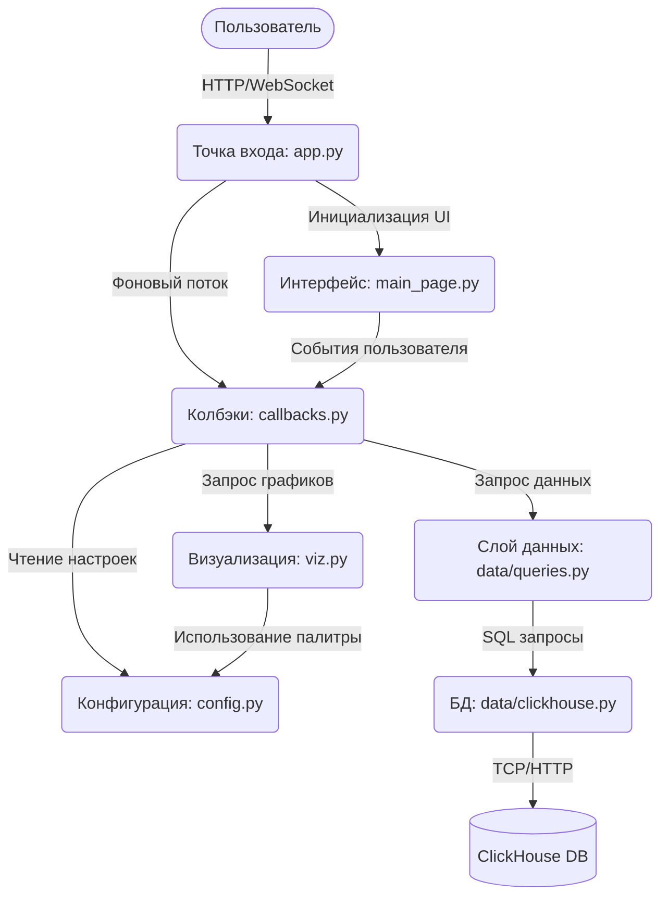

# ChainBI — DEX Analytics: Архитектура приложения

## 1. Требования к технологическому стеку
* **Язык программирования:** Python 3.
* **Фреймворк пользовательского интерфейса:** Taipy >= 4.0.
* **Библиотеки визуализации и обработки данных:** Plotly >= 5.0, Pandas >= 2.0, NumPy >= 1.26.
* **База данных:** ClickHouse.
* **Драйвер базы данных:** clickhouse-connect >= 0.7.
* **Управление окружением:** python-dotenv >= 1.0.

## 2. Компонентная диаграмма

## 3. Описание компонентов

### 3.1 Точка входа (app.py)

Роль: Центральный узел запуска приложения и управления клиентскими сессиями.

Функционал:

+ Инициализирует Taipy GUI и применяет глобальные стили (assets/main.css).

+ Запускает фоновый daemon-поток (_auto_refresh_loop) для цикличного автообновления данных.

+ Управляет списком подключенных клиентов (_clients), регистрируя их при старте сессии.

+ Проверяет и инициирует схему базы данных при запуске.

### 3.2 Модуль пользовательского интерфейса (pages/main_page.py)
Роль: Декларативное описание frontend-части приложения (Taipy Python Builder - tgb).

Функционал:

+ Объявляет глобальные переменные: фильтры, данные таблиц, объекты фигур Plotly.

+ Формирует адаптивную сетку приложения: сворачиваемая панель (`sidebar`), основная часть с тремя секциями («Топ-50», «Анализ рынка», «Анализ тренда»).

+ Реализует три независимых блока фильтра игроков: «Включить игроков» (без режима — всегда означает «их пулы»), «Исключить пулы игроков» и «Исключить сделки игроков», каждый со своим полем ввода адреса и набором чипсов для удаления.

+ Реализует фильтр пулов с переключателем режима «Только выбранные» / «Кроме выбранных» и своим набором чипсов.

+ Чипсы фильтров рендерятся как фиксированный пул из `MAX_CHIPS` слотов с условным `render`, заголовок чипса формирует хелпер `chip_label` (сокращённый адрес + крестик).

+ Осуществляет двустороннее связывание (binding) между визуальными элементами и переменными состояния; для таблиц с динамическим заголовком колонки (`top_cols`, `pools_cols`) явно задаёт `rebuild=True`.

### 3.3 Модуль бизнес-логики и обработки событий (callbacks.py)
Роль: Обработчик состояний и связующее звено между UI и слоем данных.

Функционал:

+ Содержит главную функцию `refresh_all`, которая собирает словарь фильтров (`get_filters`) и перечитывает весь слой данных, обновляя все привязанные state-переменные (Топ-50, графики рынка, графики тренда).

+ `get_filters` транслирует состояние UI в контракт фильтров слоя данных: `include_players`, `exclude_players`, `exclude_mode`, `pools`, `pools_mode`, `time_range` — с реверс-преобразованием человекочитаемых подписей в внутренние ключи через словари `_TIME_KEY`, `_EXCLUDE_MODE_KEY`, `_POOL_MODE_KEY` и др.

+ Обрабатывает раздельные действия для фильтра «Включить игроков» (`add_include_shark`/`remove_include_shark`) и фильтра «Исключить игроков» (`add_exclude_shark`/`remove_exclude_shark`), а также фильтра пулов (`add_pool`/`remove_pool`) — каждое действие инициирует `refresh_all`.

+ Собирает (`_build_top50`) таблицу Топ-50 для секции «Топ-50»: при активном фильтре включения распознаёт ответ слоя данных (доп. колонки объёма выбранных игроков/пулов, общего объёма и доли в %) и подменяет состав колонок таблицы (`top_cols`) и данные для круговой диаграммы (`pie_df`); при отсутствии фильтра — обычная таблица «сущность | объём».

+ Пересобирает фигуры без повторного запроса данных по ползункам числа сегментов (`rebuild_pie`, `rebuild_area1`), используя уже загруженные `data_top50_pie` / `data_area1`.

+ Управляет раскрытием строки метрики в «Анализе рынка» (`toggle_metric` → `_refresh_expanded_metric`) и сворачиванием/разворачиванием сайдбара (`toggle_sidebar`).

+ Для секции «Анализ тренда» формирует таблицы «ушли/зашли» из объединённого ответа `queries.get_pools_delta` и графики «микро/макро» динамики (`get_daily_micro_macro`) с заголовками, зависящими от выбранного разреза (пулы/игроки).

### 3.4 Модуль визуализации (viz.py)
Роль: Генерация интерактивных графиков.

Функционал:

+ Инкапсулирует логику работы с библиотекой plotly.graph_objects.

+ Принимает DataFrame-ы (в т.ч. с фильтром, с долей и общим объёмом) и возвращает готовые объекты go.Figure.

+ Содержит единый словарь настроек макета (_LAYOUT) и цветовую палитру (_COLORS) для соблюдения дизайн-кода дашборда.

+ Формирует сложные диаграммы: pie charts, stacked filled areas (с прореживанием до N серий + сворачиванием остатка в «Others»), heatmaps, timeseries и сгруппированные линейные графики (micro/macro).

### 3.5 Модуль конфигурации (config.py)
Роль: Хранение глобальных констант и параметров приложения.

Функционал:

+ Определяет словари с подписями для UI: временные рамки, разрез Топ-50 (пулы/игроки), метрики тренда, группировки, режимы исключения игроков (`EXCLUDE_PLAYER_MODES`: исключить пулы / исключить сделки) и режимы фильтра пулов (`POOL_MODES`: только / кроме), а также значения по умолчанию для каждого из них.

+ Устанавливает лимиты для графиков и таблиц (размер топ-N, лимиты heatmap, лимиты area-серий, диапазон ползунков частей).

+ Управляет настройками автообновления сервера (интервал в секундах) и точкой отсчёта времени (`TIME_ANCHOR`: «now» — серверное время / «data» — максимум по данным).

### 3.6 Слой доступа к данным (data/queries.py и data/clickhouse.py)
Роль: Взаимодействие с базой данных и формирование дашборда.

Функционал:

+ Транслирует словарь `filters` (`include_players`, `exclude_players`, `exclude_mode`, `pools`, `pools_mode`, `time_range`) в безопасные параметризованные SQL-запросы к материализованному представлению `mv_dex_analytics_data`.

+ Центральный хелпер `_scope` строит единое условие WHERE и параметры для всех запросов:
  - **Включить игроков** (`include_players`) — всегда include-логика «пулы, в которых были эти игроки» (через подзапрос членства) либо, в режиме `include_clause="trades"`, прямой фильтр по сделкам этих игроков;
  - **Исключить игроков** (`exclude_players` + `exclude_mode`) — глобальное вычитание: либо весь пул целиком (`exclude_pools`), либо только сделки этих адресов (`exclude_trades`);
  - **Пулы** (`pools` + `pools_mode`) — «только» выбранные либо «кроме» выбранных.

+ Возвращает **обогащённые** витрины при активных фильтрах:
  - `get_top_pools` — при включённых игроках добавляет колонки объёма игроков в пуле, общего объёма пула и доли (%), через комбинатор `-MergeIf` за один скан;
  - `get_top_players` — зеркально, при включённых (режим «только») пулах добавляет объём игрока в этих пулах, его общий объём по рынку и долю (%).

+ Формирует объединённый расчёт «ушли/зашли» (`get_pools_delta`) за один проход по двум окнам (today + reference) с set-difference в Python вместо четырёх отдельных запросов.

+ Строит раздельные «микро/макро» временные ряды (`get_daily_micro_macro`) в зависимости от разреза: по пулам — объём включённых игроков vs. общий объём тех же пулов; по игрокам — личные объёмы включённых игроков vs. объём всего рынка (за вычетом исключений).

+ Запрашивает агрегированные метрики, heatmaps (акулы×пулы, время×пулы) и временные ряды площадей (filled area) по пулам/игрокам.

+ Управляет подключением к ClickHouse через драйвер.

+ Предоставляет механизм "заглушек" (USE_STUB) для разработки и тестирования без поднятой базы данных.

### 3.7 База данных (ClickHouse)
Роль: Колоночная СУБД для хранения и быстрой агрегации блокчейн-данных.

Функционал:

+ Хранит материализованные представления (Materialized Views) транзакций DEX (`mv_dex_analytics_data`, агрегаты по минутным бакетам пул×игрок).

+ Выполняет тяжелые аналитические запросы (расчет медиан, группировки по времени и парам токенов, -MergeIf для обогащённых витрин с долями) в реальном времени.
